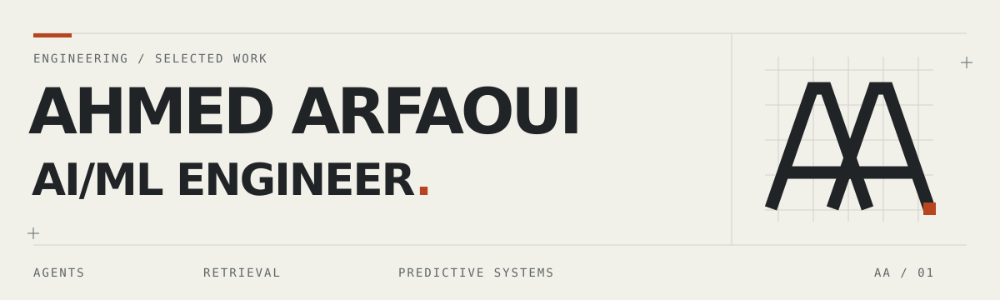

<picture>
  <source media="(prefers-color-scheme: dark)" srcset="assets/header-dark.svg">
  
</picture>

# Ahmed Arfaoui · AI/ML Engineer

I build systems that turn messy inputs into useful decisions: browser agents that collect evidence, search pipelines that rank relevant results, and ML models that serve predictions with uncertainty.

My work spans **Python and TypeScript**, from data collection and model evaluation to APIs, orchestration, and the interfaces people use to inspect the results.

**[Portfolio](https://ahmed-arfaoui-portfolio.vercel.app)** · **[LinkedIn](https://www.linkedin.com/in/ahmedarfaoui99/)** · **[Email](mailto:ahmedarfaoui2000@gmail.com)**

## 01 / Selected systems

### [Open Web Catcher](https://github.com/arfaouiahmed1/Open-Web-Catcher)
**Multi-agent browser automation for streaming-piracy investigation.**

Coordinates classification, landing-page, hosting-page, and embedded-player specialists to navigate dynamic sites and collect stream URLs, screenshots, and provider context.

- **Orchestration:** LangGraph handoffs, role-scoped tools, execution budgets, and cancellation.
- **Evidence:** Playwright MCP tools capture browser state and media candidates; an operator console exposes runs, tool calls, and cost/token telemetry.

`Python` `LangGraph` `Playwright / MCP` `FastAPI` `PostgreSQL` `Next.js`

[Architecture](https://github.com/arfaouiahmed1/Open-Web-Catcher/blob/main/docs/wiki/Architecture.md) · [Orchestrator code](https://github.com/arfaouiahmed1/Open-Web-Catcher/blob/main/src/agents/orchestrator.py) · [Console screenshots](https://github.com/arfaouiahmed1/Open-Web-Catcher#-commercial-features)

### [HuntFlow](https://github.com/arfaouiahmed1/huntflow)
**A local-first AI workspace for the full job-application workflow.**

Connects job discovery, candidate evidence, document drafting, and application tracking in a single-user application.

- **Data pipeline:** ATS connectors, per-host rate limiting, circuit breakers, and bucketed deduplication that preserves source provenance.
- **Agent workflows:** LangGraph orchestration with SQLite checkpoints and human approval gates; a document vault combines BM25 and vector retrieval through reciprocal rank fusion.

`TypeScript` `Next.js` `LangGraph` `SQLite` `Python / FastAPI` `Docker`

[Architecture](https://github.com/arfaouiahmed1/huntflow/blob/master/docs/ARCHITECTURE.md) · [Retrieval code](https://github.com/arfaouiahmed1/huntflow/blob/master/src/lib/vault/search.ts) · [Run locally](https://github.com/arfaouiahmed1/huntflow#quickstart)

### [PitWall ML](https://github.com/arfaouiahmed1/PitWall-ML)
**Lap-time forecasting and race-strategy simulation.**

Combines race-data ingestion, pace models, uncertainty calibration, and a strategy simulator with an API and race dashboard.

- **Modeling:** LightGBM pace models, a physics-plus-residual model, session-based evaluation splits, conformal calibration, and leakage tests.
- **Operations:** FastAPI serving, WebSocket updates, and drift monitoring.
- **Recorded evaluation:** **1.27 s MAE across 3,931 test laps**, with **78.6% calibrated coverage** for a nominal 80% interval. Reported for the committed champion run; evaluation artifacts and session splits are linked below.

`Python` `Polars` `LightGBM` `FastAPI` `Next.js` `Prometheus`

[Dashboard demo](https://arfaouiahmed1.github.io/PitWall-ML/) · [Evaluation artifact](https://github.com/arfaouiahmed1/PitWall-ML/blob/main/artifacts/champion/metrics.json) · [Data splits](https://github.com/arfaouiahmed1/PitWall-ML/blob/main/artifacts/champion/splits.json)

### [SignalRank](https://github.com/arfaouiahmed1/signalrank)
**A retrieval and ranking workbench for matching CVs to jobs.**

Separates candidate retrieval, rank fusion, and optional cross-encoder reranking so each stage can be compared.

- **Retrieval:** BM25, PostgreSQL full-text search, and pgvector search paths; reciprocal rank fusion combines candidate lists.
- **Evaluation:** precision, recall, MRR, and nDCG with ablations. The committed **500-job** evaluation compares retrieval baselines using weak relevance labels, with cross-encoder evaluation kept separate.

`Python` `FastAPI` `PostgreSQL / pgvector` `Sentence Transformers` `React`

[Interactive demo](https://arfaouiahmed1.github.io/signalrank/) · [Ranking code](https://github.com/arfaouiahmed1/signalrank/blob/main/backend/app/retrieval/hybrid.py) · [Evaluation artifact](https://github.com/arfaouiahmed1/signalrank/blob/main/artifacts/metrics.json)

## 02 / Beyond the core

| Project | Engineering focus | Explore |
| :--- | :--- | :--- |
| **[FarmWise](https://github.com/arfaouiahmed1/Data-Farmers-FarmWise-4DS3)** | Collaborative agricultural application connecting crop prediction and YOLO image-model endpoints to a Django REST / Next.js interface. | [Video demo](https://youtu.be/bAqBds2t3mg) |
| **[Pursivo](https://github.com/arfaouiahmed1/pursivo)** | Android application tracker with Room persistence, an evidence vault, and optional provider-backed AI drafting. Kotlin / Compose; alpha foundation. | [Architecture](https://github.com/arfaouiahmed1/pursivo/blob/main/docs/architecture.md) |

## 03 / Technical focus

| Area | What I work on |
| :--- | :--- |
| **Agent systems** | LangGraph state machines, browser tools, structured handoffs, checkpoints, human approval |
| **Retrieval & ranking** | BM25, vector search, rank fusion, cross-encoders, relevance evaluation |
| **Predictive ML** | Feature engineering, boosted trees, temporal/session splits, calibration, error analysis |
| **System delivery** | FastAPI, SQL persistence, Docker, TypeScript interfaces, execution traces and monitoring |

I care about the whole path: where the data came from, what the model actually measured, how failures are handled, and whether someone can inspect the result.

---

**Interested in AI/ML engineering work involving agents, retrieval, or predictive systems?**  
[Let's talk](mailto:ahmedarfaoui2000@gmail.com) · [Explore my portfolio](https://ahmed-arfaoui-portfolio.vercel.app)
