

  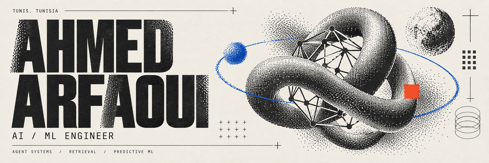

  <strong>AI / ML ENGINEER</strong> &nbsp;·&nbsp; AGENT SYSTEMS &nbsp;·&nbsp; RETRIEVAL &nbsp;·&nbsp; PREDICTIVE ML

I build the parts of AI products that have to survive contact with the real world: browser agents that leave evidence, retrieval systems that can be evaluated, and predictive services that expose uncertainty instead of hiding it.

My work moves across **Python and TypeScript**, from data ingestion and model evaluation to LangGraph orchestration, FastAPI services, SQL persistence, monitoring, and the interfaces people use to inspect a run.

**[Portfolio](https://ahmed-arfaoui-portfolio.vercel.app)** · **[LinkedIn](https://www.linkedin.com/in/ahmedarfaoui99/)** · **[Email](mailto:ahmedarfaoui2000@gmail.com)** · **[Download résumé](resume/Ahmed-Arfaoui-AI-ML-Engineer-Resume.pdf)**

[My journey](#00--my-journey) · [Internships](#01--internships) · [Core systems](#02--core-systems) · [Evidence](#03--evidence-over-decoration) · [Technical focus](#06--technical-focus)

## 00 / My journey

<picture>
  <source media="(prefers-color-scheme: dark)" srcset="assets/journey-dark.png">
  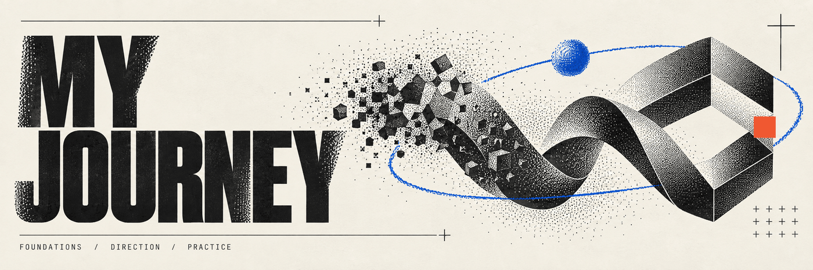
</picture>

My route into engineering was not a straight line. I started with the **Mathematics and Physics preparatory cycle at IPEIB (2019–2022)**. It was a difficult period, and I changed direction rather than letting the first route define the outcome.

At **ESPRIT (2022–2026)** I completed an engineering degree in Software Engineering, specialized in Data Science & AI, and graduated with **Mention Excellent**. Internships during that period turned that direction into a practice: reporting and forecasting, then applied ML services, then GenAI-assisted modernization, and finally multi-agent browser intelligence.

| Period | Chapter | What it added |
| :--- | :--- | :--- |
| **2019–2022** | IPEIB · preparatory cycle | Mathematics, physics, resilience, and a deliberate change of route |
| **2022–2026** | ESPRIT · software engineering | Data Science & AI specialization, systems engineering, Mention Excellent |
| **2024–2026** | Four internships | Forecasting → APIs and clustering → GenAI modernization → agentic systems |
| **2026 →** | AI / ML engineering | Building inspectable systems that connect models to decisions |

## 01 / Internships

<picture>
  <source media="(prefers-color-scheme: dark)" srcset="assets/internships-dark.png">
  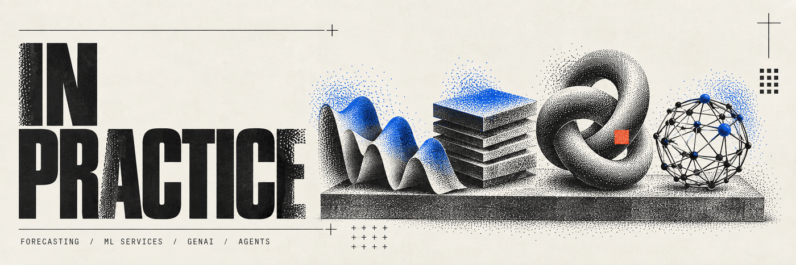
</picture>

These placements are the connective tissue between my education and the systems in the repositories below. The results are reported from my résumé and project evaluations; they are kept scoped to the work where they were measured.

### Soft Stars · AI & Agentic Systems Engineering Intern
**December 2025 – June 2026 · Graduation internship**

Built **[Open Web Catcher](https://github.com/arfaouiahmed1/Open-Web-Catcher)**, a multi-agent web-intelligence system for navigating dynamic pages and collecting inspectable evidence.

- Evolved an n8n / Puppeteer prototype into a LangChain / LangGraph / MCP / FastAPI / Next.js architecture.
- Recorded **126 end-to-end runs**, **97.6% tool-call success**, and **$0.152 average persisted-run cost** in the project evaluation.
- Connected PostgreSQL persistence and Azure Service Bus around resumable, observable runs.

### VERMEG · Data Science Intern
**August 2025 – September 2025**

Worked on AI-assisted legacy-code modernization: converting **50+ XML security configurations into Java** with Spring Boot and Spring AI.

- Reached **90% conversion accuracy** in the evaluated set.
- Reduced manual refactoring effort by approximately **95%** for the targeted workflow.
- The engineering constraint was not just generation; it was preserving structure and making the output reviewable.

### ESPRIT · Data Science Intern
**June 2025 – August 2025**

Built the backend and data layer for an ML learning platform, including **FastAPI services**, data models, database infrastructure, and Gemini-backed RAG for personalized quiz generation.

- Evaluated **six clustering approaches** rather than selecting an algorithm by default.
- Improved the measured silhouette score by **15%** and kept inference under **200 ms** in the reported evaluation.

### CMR Tunisie · BI & Data Science Intern
**July 2024 – August 2024**

Worked with multi-source sales data across ingestion, cleaning, transformation, and analytics. Compared **ARIMA, SARIMA, SARIMAX, and Prophet** models for time-series forecasting, building the analytical foundation that later shaped my interest in production ML evaluation.

## 02 / Core systems

<picture>
  <source media="(prefers-color-scheme: dark)" srcset="assets/systems-dark.png">
  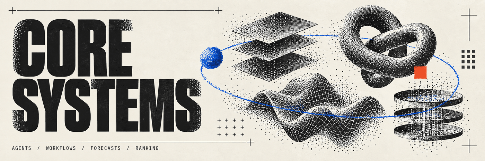
</picture>

  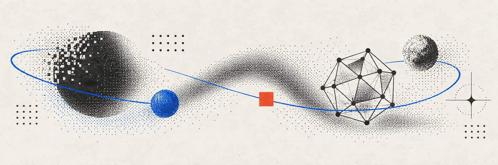

FIELD NOTE / INPUT → EVIDENCE → DECISION → TRACE

### [Open Web Catcher](https://github.com/arfaouiahmed1/Open-Web-Catcher)
**Browser agents that collect evidence from difficult web surfaces.**

The system coordinates role-scoped specialists for classification, landing pages, hosting pages, and embedded players. A LangGraph orchestrator controls handoffs and budgets; Playwright MCP operates an isolated browser context; FastAPI and PostgreSQL persist the run; a Next.js console makes tool calls and evidence inspectable.

<strong>Architecture map</strong>

<picture>
  <source media="(prefers-color-scheme: dark)" srcset="assets/architecture-owc-dark.png">
  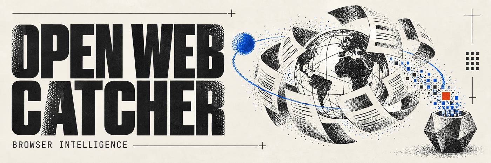
</picture>

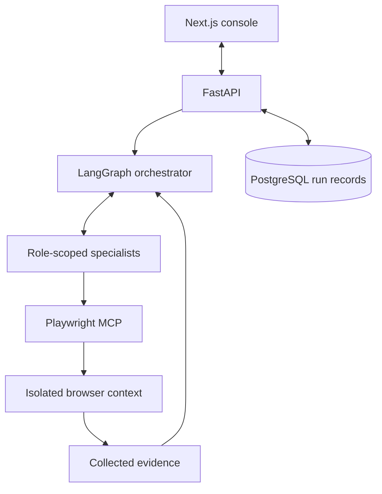

[Architecture notes](https://github.com/arfaouiahmed1/Open-Web-Catcher/blob/main/docs/wiki/Architecture.md) · [Orchestrator](https://github.com/arfaouiahmed1/Open-Web-Catcher/blob/main/src/agents/orchestrator.py)

`Python` `LangGraph` `Playwright MCP` `FastAPI` `PostgreSQL` `Next.js`

### [HuntFlow](https://github.com/arfaouiahmed1/huntflow)
**A local-first application workflow with retrieval and human gates.**

HuntFlow connects job discovery, candidate evidence, document drafting, and application tracking. ATS connectors use per-host rate limits and circuit breakers; bucketed deduplication preserves provenance; LangGraph workflows checkpoint in SQLite; the evidence vault combines BM25 and vector retrieval with reciprocal rank fusion before a human review step.

<strong>Architecture map</strong>

<picture>
  <source media="(prefers-color-scheme: dark)" srcset="assets/architecture-huntflow-dark.png">
  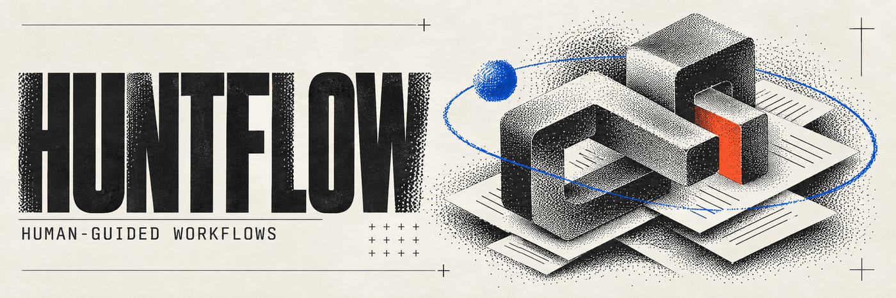
</picture>

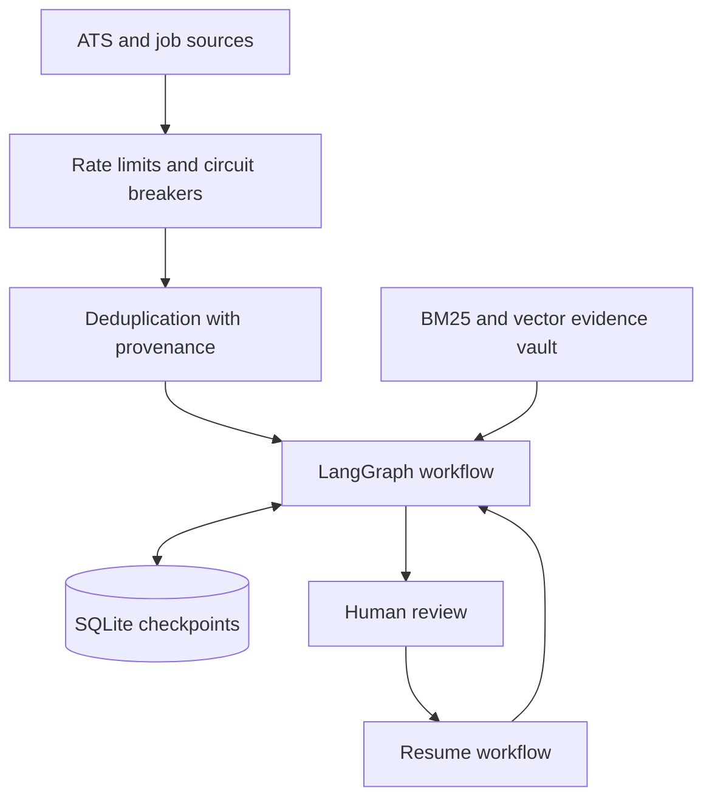

[Architecture](https://github.com/arfaouiahmed1/huntflow/blob/master/docs/ARCHITECTURE.md) · [Vault retrieval](https://github.com/arfaouiahmed1/huntflow/blob/master/src/lib/vault/search.ts)

`TypeScript` `Next.js` `LangGraph` `SQLite` `BM25` `Vector retrieval`

### [PitWall ML](https://github.com/arfaouiahmed1/PitWall-ML)
**Lap-time forecasting with calibrated uncertainty and a strategy simulator.**

The project combines race-data ingestion, Polars feature pipelines, LightGBM pace models, a physics-plus-residual path, temporal/session splits, conformal calibration, FastAPI/WebSocket serving, and Prometheus/Grafana drift monitoring.

<strong>Architecture map</strong>

<picture>
  <source media="(prefers-color-scheme: dark)" srcset="assets/architecture-pitwall-dark.png">
  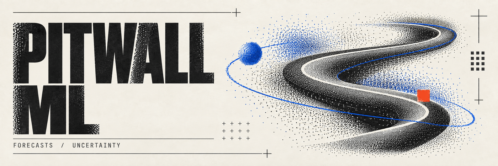
</picture>

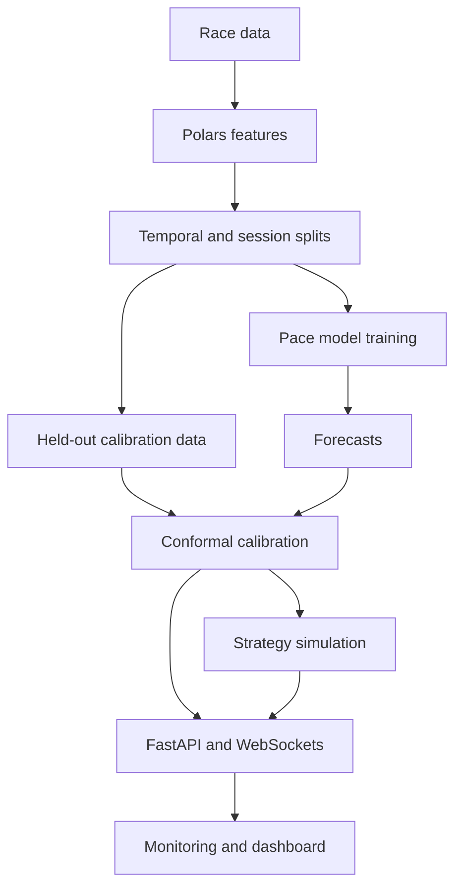

[Champion metrics](https://github.com/arfaouiahmed1/PitWall-ML/blob/main/artifacts/champion/metrics.json) · [Session splits](https://github.com/arfaouiahmed1/PitWall-ML/blob/main/artifacts/champion/splits.json) · [Dashboard](https://arfaouiahmed1.github.io/PitWall-ML/)

`Python` `Polars` `LightGBM` `FastAPI` `WebSockets` `Prometheus`

### [SignalRank](https://github.com/arfaouiahmed1/signalrank)
**A retrieval and ranking workbench for matching CVs to jobs.**

SignalRank keeps the search stages explicit: BM25 and PostgreSQL full-text retrieval sit beside pgvector search; reciprocal rank fusion combines candidate lists; an optional cross-encoder can rerank them; precision, recall, MRR, and nDCG make the trade-offs measurable.

<strong>Architecture map</strong>

<picture>
  <source media="(prefers-color-scheme: dark)" srcset="assets/architecture-signalrank-dark.png">
  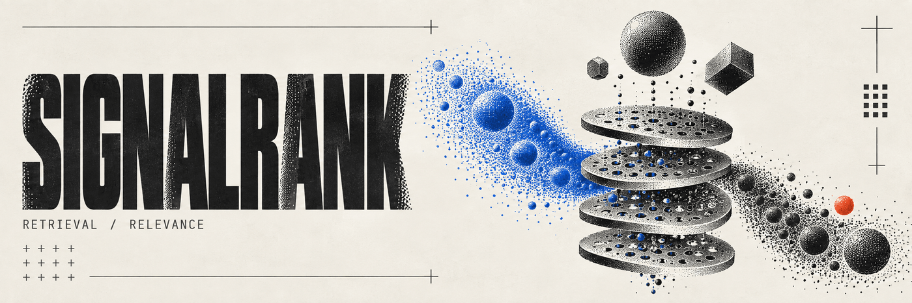
</picture>

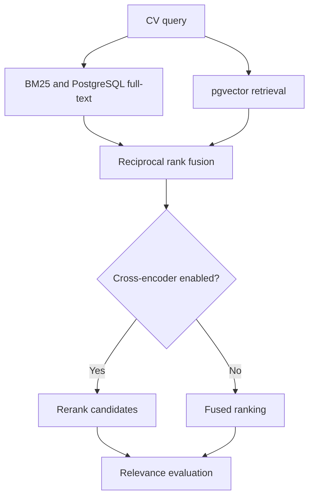

[Retrieval code](https://github.com/arfaouiahmed1/signalrank/blob/main/backend/app/retrieval/hybrid.py) · [Evaluation artifact](https://github.com/arfaouiahmed1/signalrank/blob/main/artifacts/metrics.json) · [Demo](https://arfaouiahmed1.github.io/signalrank/)

`Python` `FastAPI` `PostgreSQL` `pgvector` `Sentence Transformers` `React`

## 03 / Evidence over decoration

<picture>
  <source media="(prefers-color-scheme: dark)" srcset="assets/evidence-dark.png">
  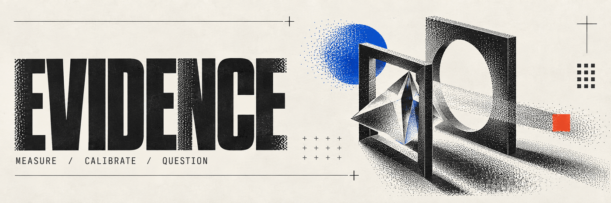
</picture>

These are the results supported by the committed artifacts and scoped project evaluations:

| Evidence | Recorded result | Scope |
| :--- | :--- | :--- |
| **PitWall ML** | **1.27 s MAE** across **3,931 test laps** | Committed champion metrics artifact |
| **PitWall ML** | **58.4% raw → 78.6% calibrated coverage** | Nominal 80% interval; calibration widens mean interval from **1.20 s → 2.26 s** |
| **SignalRank** | **500 jobs / qrels** with P@K, recall, MRR, and nDCG comparisons | Weak relevance labels; one committed evaluation artifact |
| **Open Web Catcher** | **126 runs · 97.6% tool-call success · $0.152 average persisted-run cost** | Internship/project evaluation reported in résumé |

Calibration is a product decision as much as a modeling step: coverage moves toward the target, but the interval gets wider. Retrieval metrics are treated as an experiment, not a universal claim; the SignalRank artifact explicitly uses weak labels and keeps cross-encoder results separate.

<strong>PitWall calibration: coverage and interval width</strong>

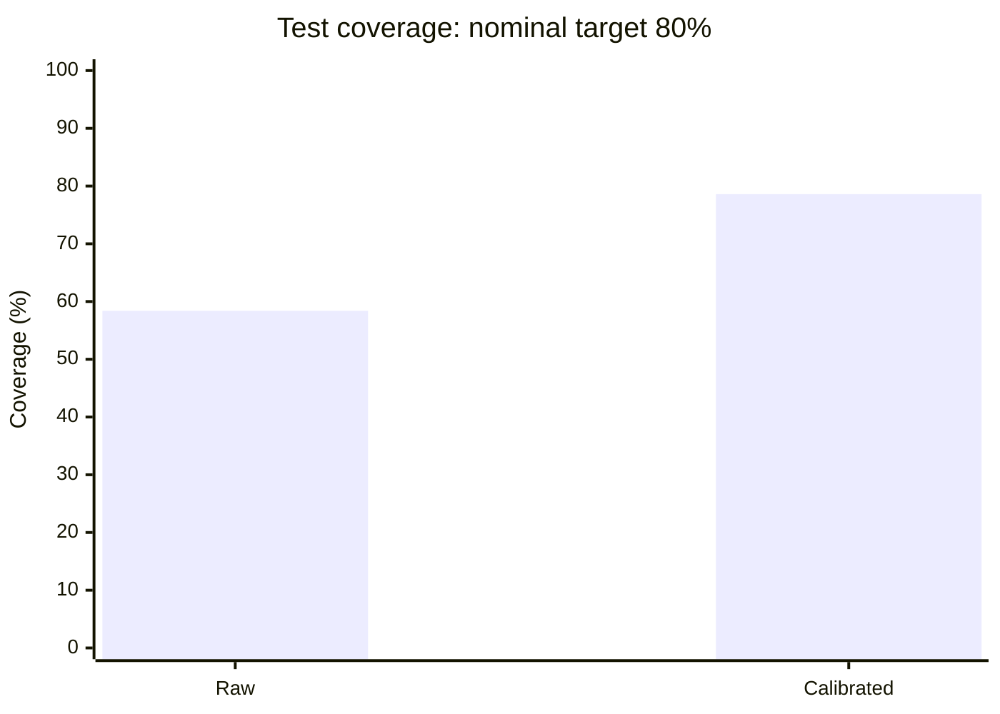

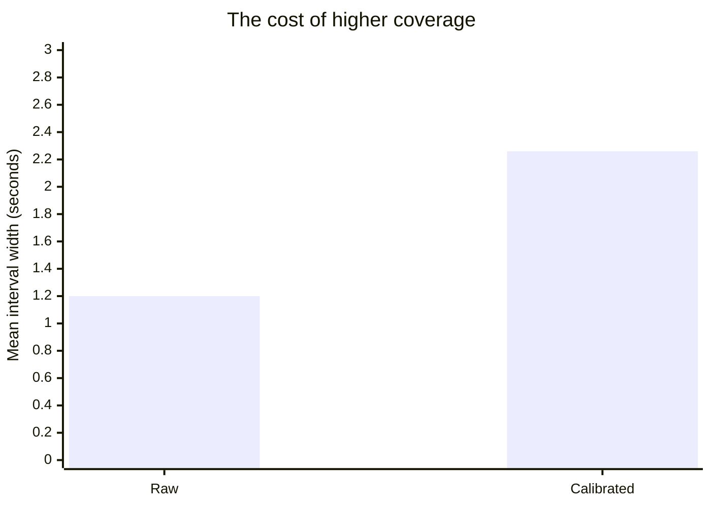

Same committed champion artifact; **3,931 test laps**. Higher coverage comes with wider intervals. [Source metrics](https://github.com/arfaouiahmed1/PitWall-ML/blob/main/artifacts/champion/metrics.json).

## 04 / Supporting work

| Project | Why it belongs in the field notes | Explore |
| :--- | :--- | :--- |
| **[FarmWise](https://github.com/arfaouiahmed1/Data-Farmers-FarmWise-4DS3)** | Collaborative agricultural application connecting crop-prediction and YOLO image-model endpoints to a Django REST / Next.js interface. | [Video demo](https://youtu.be/bAqBds2t3mg) |
| **[Pursivo](https://github.com/arfaouiahmed1/pursivo)** | Kotlin / Compose Android application tracker with Room persistence, an evidence vault, and optional provider-backed AI adapters. | [Architecture](https://github.com/arfaouiahmed1/pursivo/blob/main/docs/architecture.md) |

These projects widen the range of the portfolio without competing with the four systems above for the main narrative.

## 05 / How the systems fit together

<picture>
  <source media="(prefers-color-scheme: dark)" srcset="assets/timeline-dark.png">
  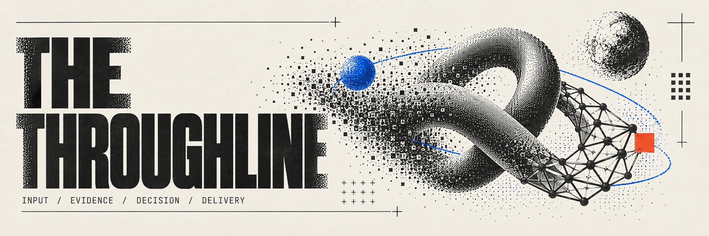
</picture>

The recurring loop is simple to state and difficult to fake:

**Messy input becomes structured evidence. Models and agents turn that evidence into decisions; evaluation and inspectable delivery make the result useful.**

That loop appears in different forms across the portfolio:

- **Open Web Catcher:** pages become browser evidence, then agent decisions and operator traces.
- **HuntFlow:** job sources become provenance-preserving records, then retrieved context and reviewable drafts.
- **SignalRank:** a CV becomes lexical/vector candidates, then a fused ranking with relevance metrics.
- **PitWall ML:** timing data becomes temporally split features, then calibrated forecasts and simulation outputs.

## 06 / Technical focus

<picture>
  <source media="(prefers-color-scheme: dark)" srcset="assets/evaluation-dark.png">
  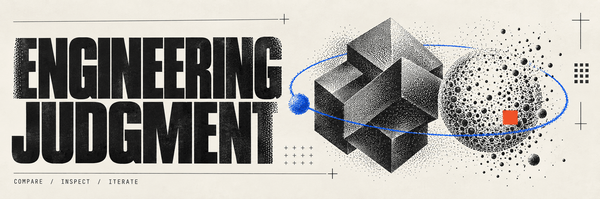
</picture>

| Area | What I actually build |
| :--- | :--- |
| **Agent systems** | LangGraph state machines, bounded handoffs, role-scoped tools, browser automation, checkpoints, cancellation, human approval |
| **Retrieval & ranking** | BM25, PostgreSQL full-text search, pgvector, reciprocal rank fusion, optional cross-encoders, ablations, relevance metrics |
| **Predictive ML** | Polars feature engineering, LightGBM, physics-plus-residual models, temporal/session splits, conformal calibration, error analysis |
| **Backend & delivery** | FastAPI, PostgreSQL / SQLite, Docker, WebSockets, Azure Service Bus, Prometheus/Grafana, Next.js / React interfaces |
| **Engineering quality** | Evidence records, reproducible artifacts, leakage tests, rate limits, circuit breakers, fallbacks, cost and token telemetry |

## 07 / Current direction

I am looking for AI/ML engineering work where the interesting problems are at the boundary: agents that need guardrails, retrieval that needs honest evaluation, and models that have to become dependable services.

**[Start with the portfolio](https://ahmed-arfaoui-portfolio.vercel.app)** · **[Read the résumé](resume/Ahmed-Arfaoui-AI-ML-Engineer-Resume.pdf)** · **[Connect on LinkedIn](https://www.linkedin.com/in/ahmedarfaoui99/)**

Visual system: raster dither-print geometry, restrained cobalt / vermilion accents, condensed display type, and a shared editorial grid. All project claims above are grounded in the linked repositories, committed artifacts, résumé, or portfolio source.
